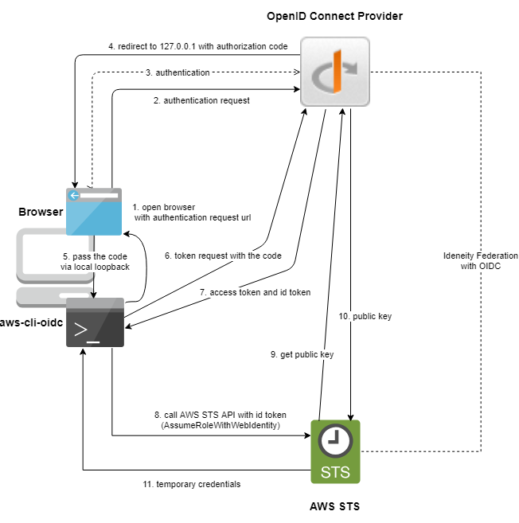
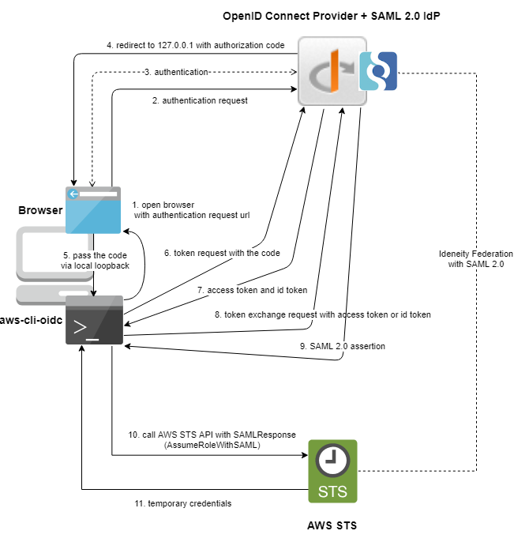

# aws-cli-oidc

CLI tool for retrieving AWS temporary credentials using OIDC provider.

## How does it work?

[AWS Identity Providers and Federation](https://docs.aws.amazon.com/IAM/latest/UserGuide/id_roles_providers.html) supports IdPs that are compatible with [OpenID Connect (OIDC)](http://openid.net/connect/) or [SAML 2.0 (Security Assertion Markup Language 2.0)](https://wiki.oasis-open.org/security). This tool works with both types of IdP if it supports OIDC because it works as OIDC client. If the federation between the AWS account and the IdP is established, and an OIDC client for this tool is registered in the IdP, you can get AWS temporary credentials via standard browser login. It means you don't need to pass your credential of the IdP to this tool.

Please refer the following diagrams how it works.

### Federation type: OIDC



### Federation type: SAML 2.0

**Note: The OIDC provider must support [OAuth 2.0 Token Exchange](https://tools.ietf.org/html/draft-ietf-oauth-token-exchange-15) for exchanging access token/ID token and SAML2 assertion.**



## Prerequisite AWS and OIDC provider settings before using this tool

Before using this tool, the system administrator need to setup the following configuration.

- Identity Federation using SAML2/OIDC between AWS and the OIDC provider. See https://docs.aws.amazon.com/IAM/latest/UserGuide/id_roles_providers.html
- Registration OIDC/OAuth2 client for this CLI tool in the OIDC provider. Note: The OIDC provider must allow any port to be specified at the time of the request for loopback IP redirect URIs because this tool follows [RFC 8252 OAuth 2.0 for Native Apps 7.3 Loopback Interface Redirection](https://tools.ietf.org/html/rfc8252#section-7.3).

Also depending on the federation type between AWS and the OIDC provider, requirements for the OIDC providers will change.

### Federation type: OIDC

- The OIDC provider only needs to support OIDC. SAML2 and OAuth 2.0 Token Exchange are not necessary. Very simple.
- However, the JWKS endpoint of the OIDC provider needs to export it to the Internet because AWS try to access the endpoint to obtain the public key and to verify the ID token which is issued by the provider.

### Federation type: SAML 2.0

- Of course, the OIDC provider must support not only OIDC but also SAML2 for federation between itself and AWS.
- The OIDC provider must support [OAuth 2.0 Token Exchange](https://tools.ietf.org/html/draft-ietf-oauth-token-exchange-15) for exchanging access token/ID token and SAML2 assertion. `aws-cli-oidc` gets access token/ID token from the OIDC provider first, then it needs to get SAML2 assertion from the provider which is required for getting AWS temporary credentials using AWS STS API.

## Tested OIDC Provider

| OIDC Provider                                                                  | OIDC | SAML2       |
| ------------------------------------------------------------------------------ | ---- | ----------- |
| [Google account](https://accounts.google.com/.well-known/openid-configuration) | OK   | -           |
| [Keycloak](https://www.keycloak.org)                                           | OK   | OK (Note 1) |

- Note 1: You need to use Keycloak 12 or higher that supports exchanging from access token to SAML2 assertion. Also, you need to enable Token Exchange feature.

## Keycloak configuration

### Before you start:
- Have a [saml2 client](https://neuw.medium.com/aws-connect-saml-based-identity-provider-using-keycloak-9b3e6d0111e6) setup in your realm. Ensure you can login and switch to your accounts.
- This setup was completed on keycloak 16.1.0
- Ensure the keycloak server is started with the following flags:
  - -Dkeycloak.profile.feature.admin_fine_grained_authz=enabled
  - -Dkeycloak.profile.feature.token_exchange=enabled
  This enables the preview features of fine grained authorization and [token exchange](https://www.keycloak.org/docs/latest/securing_apps/index.html#internal-token-to-internal-token-exchange).

### Setup an OpenID client
```
access_type                  = "CONFIDENTIAL"
enabled                      = "true"
standard_flow_enabled        = "true"
type                         = "openid"
valid_redirect_uris          = [
  "http://localhost:*",
  "http://127.0.0.1:*"
]
```

### Setup Permissions for the Token Exchange
As found on this link here: https://www.keycloak.org/docs/latest/securing_apps/index.html#_client_to_client_permission
The Target is your previously setup and working saml2 client.
When you add the client policy the client you add is your newly created OpenID client you created above.

### Setup aws-cli-oidc
aws:
  aws_federation_type: saml2
  client_auth_ca: ""
  client_auth_cert: ""
  client_auth_key: ""
  client_id: "yournewlycreatedopenidclient"
  client_secret: "theclientsecretfromtheaboveclient"
  default_iam_role_arn: ""
  failure_redirect_url: ""
  insecure_skip_verify: "false"
  max_session_duration_seconds: "3600"
  oidc_authentication_request_additional_query: ""
  oidc_provider_metadata_url: https://example.com/auth/realms/mysupercoolrealm/.well-known/openid-configuration
  oidc_provider_token_exchange_audience: "yourtargetsalm2awsclient"
  oidc_provider_token_exchange_subject_token_type: urn:ietf:params:oauth:token-type:access_token
  successful_redirect_url: ""

### Usage
```
$ aws-cli-oidc get-cred -p aws
Using config file: ~/.aws-cli-oidc/config.yaml
Login successful!

Please choose the role [1-3]:

  1. arn:aws:iam::xxxxx:role/dev-User
  2. arn:aws:iam::yyyyy:role/staging-User
  3. arn:aws:iam::zzzzz:role/prod-User

Enter a value: 2

Selected role: arn:aws:iam::yyyyy:role/staging-User
Max Session Duration: 36000 seconds
Requesting AWS credentials using SAML assertion

export AWS_ACCESS_KEY_ID=...
export AWS_SECRET_ACCESS_KEY=...
export AWS_SESSION_TOKEN=...
```

## Install

Download from [Releases page](https://github.com/openstandia/aws-cli-oidc/releases).

## Usage

```
CLI tool for retrieving AWS temporary credentials using OIDC provider

Usage:
  aws-cli-oidc [command]

Available Commands:
  clear-secret Clear OS secret store that saves AWS credentials
  completion   generate the autocompletion script for the specified shell
  get-cred     Get AWS credentials and out to stdout
  help         Help about any command
  setup        Interactive setup of aws-cli-oidc

Flags:
  -h, --help   help for aws-cli-oidc

Use "aws-cli-oidc [command] --help" for more information about a command.
```

### Setup

Use `aws-cli-oidc setup` command and follow the guide.

### Get AWS temporary credentials

Use `aws-cli-oidc get-cred -p <your oidc provider name>` command. It opens your browser.
Now you can see the login page which the OIDC provider offers. Then do login.
If successful, AWS temporary credentials will be shown as below.

```
aws-cli-oidc get-cred -p myop
Using config file: /home/wadahiro/.aws-cli-oidc/config.yaml
Login successful!
Selected role: arn:aws:iam::123456789012:role/developer
PrincipalARN: arn:aws:iam::123456789012:saml-provider/myop
RoleARN: arn:aws:iam::123456789012:role/developer

export AWS_ACCESS_KEY_ID=ASIAT......
export AWS_SECRET_ACCESS_KEY=9bkS0whPelMYQ.......
export AWS_SESSION_TOKEN=FQoGZXIvYXdzENz.......
```

### Integrate aws-cli

[Sourcing credentials with an external process](https://docs.aws.amazon.com/cli/latest/userguide/cli-configure-sourcing-external.html) describes how to integrate aws-cli with external tool.
You can use `aws-cli-oidc` as the external process. Add the following lines to your `.aws/config` file.

```
[profile foo-developer]
credential_process=aws-cli-oidc get-cred -p myop -r arn:aws:iam::123456789012:role/developer -j -s -d 43200
```

Caution: The AWS temporary credentials will be saved into your OS secret store by using `-s` option to reduce authentication each time you use `aws-cli` tool.

## Licence

Licensed under the [MIT](/LICENSE) license.

## Author

- [Hiroyuki Wada](https://github.com/wadahiro)
